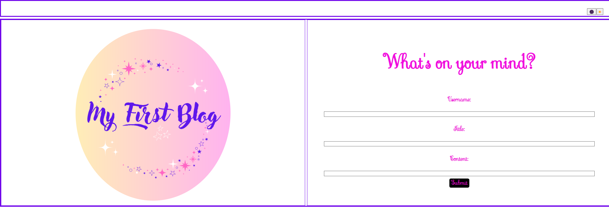
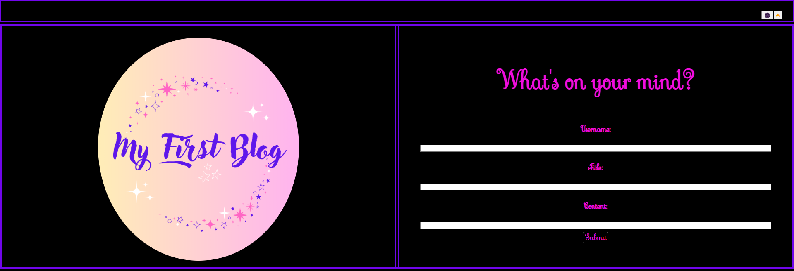

# Bunz The Blogger

## Description

Just a blog weebsite for the gal that might have something to say. 
Upon loading the page, you will be met with a form that will allow you to add a blog submission. After pressing submit, the page will redirect to the blog landing page, which will show you a list of submitted blog entries. Hope you enjoy random thoughts from my wee little mind. &#128526;

## Links

<a href="https://github.com/0-Sunny-0/Bunz-the-Blogger">GitHub Repo</a> 
<a href="https://0-sunny-0.github.io/Bunz-the-Blogger/">Deployed Link</a>
 
## Visuals

 

## Contributors

BootCamp Tutor:  
Vinnie Lopez

BootCamp Students:  
<a href="https://github.com/Kalink52/">Micah Cox</a> 
<a href="https://github.com/hannahschwen">Hannah Schwen</a>

## License

N/A
